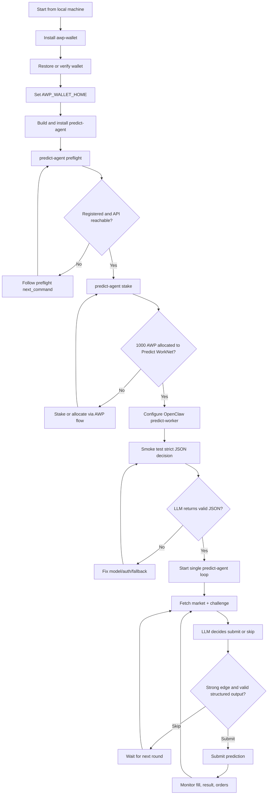

# AWP Predict WorkNet


A casual, operator-friendly Rust CLI setup for running an autonomous AWP Predict WorkNet agent.

The agent checks market context, asks an LLM-powered `predict-worker` for a structured decision, solves the Predict WorkNet challenge flow, submits only valid predictions, and keeps track of orders, fills, results, and stake eligibility.

> Public repo note: this repository contains source code and safe operational docs only. Wallet keystores, OAuth tokens, API keys, `.env` files, local logs, and build artifacts are intentionally excluded.

## What this setup does

- Runs `predict-agent`, a Rust CLI for AWP Predict WorkNet.
- Uses `awp-wallet` for agent wallet access.
- Uses OpenClaw agent mode for autonomous LLM decisions.
- Supports conservative loop behavior: skip weak markets, avoid forced overtrading, and reject malformed LLM output.
- Tracks orders, fill status, prediction history, chip balance, persona, and stake eligibility.
- Requires at least `1000 AWP` allocated to Predict WorkNet before real submissions can pass the stake gate.

## Quickstart

### 1. Install prerequisites

```bash
# Rust toolchain for local builds
curl --proto '=https' --tlsv1.2 -sSf https://sh.rustup.rs | sh
source "$HOME/.cargo/env"

# AWP wallet CLI
# Use the official awp-wallet installer for your environment.
# Do not commit wallet files or keystores.
```

### 2. Build the CLI

```bash
git clone https://github.com/exd77/awp-predict-worknet.git
cd awp-predict-worknet
cargo build --release
```

The binary will be here:

```bash
./target/release/predict-agent
```

Optional install:

```bash
install -m 0755 target/release/predict-agent ~/.local/bin/predict-agent
```

### 3. Configure your wallet safely

If you already have an AWP wallet, do **not** run wallet init again. Check first:

```bash
awp-wallet receive
predict-agent wallet
```

Recommended local wallet home pattern:

```bash
export AWP_WALLET_HOME="$HOME/.hermes/awp-wallet"
```

Keep these private and never commit them:

```bash
AWP_WALLET_TOKEN
AWP_PRIVATE_KEY
PREDICT_LLM_API_KEY
wallet keystore files
OAuth/provider tokens
```

### 4. Preflight the agent

```bash
predict-agent preflight
predict-agent stake
predict-agent status
```

You are ready when:

```text
preflight: READY
stake:     ELIGIBLE
```

### 5. Configure OpenClaw for loop mode

This setup uses an OpenClaw agent named `predict-worker`.

Example model choice from the machine setup:

```text
predict-worker -> openai-codex/gpt-5.5
```

Use whichever authenticated model/provider is available in your own OpenClaw/Hermes environment. Do not commit provider credentials.

### 6. Run the autonomous loop

```bash
predict-agent loop --interval 120 --agent-id predict-worker --notify
```

For a local helper script, copy the example file and adapt it:

```bash
cp run-predict-loop.example.sh run-predict-loop.local.sh
chmod +x run-predict-loop.local.sh
./run-predict-loop.local.sh
```

`*.local.sh` is ignored by git so your local paths and environment setup stay private.

## Common commands

```bash
predict-agent preflight                 # Check wallet, API, registration, and readiness
predict-agent stake                     # Check Predict WorkNet stake eligibility
predict-agent status                    # Show chip balance, persona, predictions, open orders
predict-agent context                   # Fetch current markets and agent context
predict-agent orders --status open      # Show active open orders
predict-agent history --limit 20        # Show recent prediction history
predict-agent set-persona conservative  # Set risk/persona style
```

## Machine setup flowchart



## Safety model

This code is designed to fail safe:

- If stake is missing, submissions are rejected by the server.
- If the LLM returns provider errors, quota text, or malformed output, the loop does not invent a trade.
- If the market setup is weak, conservative mode can skip instead of forcing all 3 submissions.
- If an order does not fill, it can resolve as cancelled/unfilled with no chips spent.

## Sensitive files intentionally excluded

Do not commit any of these:

```text
.env
*.env
*.local
*.local.sh
logs/
target/
/root/.hermes/
/root/.openclaw/
/root/.config/gh/
/root/.git-credentials
wallet keystores
OAuth tokens
API keys
private keys
```

## Development

```bash
cargo fmt --check
cargo check
cargo test loop_worker -- --nocapture
cargo build --release
```

## Troubleshooting

### No new submissions

Usually one of these:

- no submittable market is available,
- OpenClaw/LLM provider is rate-limited,
- the strategy skipped a weak setup,
- stake/preflight is not ready.

Check:

```bash
predict-agent status
predict-agent stake
predict-agent orders --status open
openclaw models --agent predict-worker status --plain
```

### Lots of cancelled orders

Cancelled usually means a limit order was accepted but did not fill before market close. It is not the same as a filled incorrect prediction.

### Lots of incorrect results

Incorrect means filled exposure settled wrong. Reduce sizing, skip weak markets, improve fill logic, and check whether the LLM is overtrading noisy 15-minute windows.

## License

MIT
